# 行政領航驅動校本專題國際化「三合一模式」簡報大綱

## Slide 1: 封面
- Title: 行政領航驅動校本專題國際化
- Subtitle: 「競賽、交流、參訪」三合一創新模式的國際教育旅行
- Key points:
  - 送件學校：臺北市立麗山高級中學
  - 報告作者：林獻升、郭瓊華、楊雅茹、林桔楷、簡君玲、陳汶靖
  - 獲獎榮譽：臺北市第 27 屆教育專業創新與行動研究中學組特優
- Layout role: cover
- Required images:
  - 封面主視覺；style/layout reference
    
    

## Slide 2: 簡報大綱 (Agenda)
- Title: 簡報大綱
- Key points:
  - 壹、緒論與研究背景：面臨的科學特色辦學困境與戰略思考
  - 貳、研究方法與歷程：行動研究與三合一模式的歷史演進
  - 參、研究結果與討論：行政領航五力模型與校本專題國際化
  - 肆、三合一模式實踐成效：科學競賽、校際交流與深度參訪實證
  - 伍、實踐省思與未來展望：精緻化策略與永續傳承建議
- Layout role: agenda

## Slide 3: 壹、緒論與背景
- Title: 壹、緒論與背景
- Subtitle: 科學特色辦學長期存在的困境與變革契機
- Layout role: section divider

## Slide 4: 科學教育特色與專題研究校本課程
- Title: 科學教育特色與專題研究
- Key points:
  - 麗山高中自民國89年創校起，以「科學教育」為發展核心
  - 率先規劃「研究方法與專題研究」作為高一二必修校本特色課程
  - 每位學生皆須完成專題研究，並於校內科展發表
  - 培育出眾多科學競賽的優秀成果與人才
- Layout role: concept explanation

## Slide 5: 辦學困境的具體呈現：代表權邊緣化
- Title: 辦學困境：代表權邊緣化
- Key points:
  - 創校初期 (2002-2007) 為 TISF 黃金時代，多次獲得 ISEF 大獎
  - 2018年後表現進入平穩期，獲獎等級多集中於三、四等獎
  - 三等獎以下作品無法獲得出國代表權，或僅能薦送次要賽事
  - 面臨「學生孕育的一年半優質專題，卻鮮少有機會走出臺灣」的痛點
- Layout role: concept explanation

## Slide 6: 數據說話：麗山高中近年參加台灣國際科展 (TISF) 統計
- Title: 近年 TISF 參賽獲獎統計
- Key points:
  - 2002-2016年：五度獲得一等獎並代表臺灣參加美國 ISEF，榮獲多項首獎與一等獎
  - 2018-2023年：主要獲得三、四等獎，代表權多為「無」或非 ISEF 代表
  - 2024-2025年：獲得三等獎，薦送突尼西亞 I-FEST 國際科技節
  - 2026年：生物化學科獲得三等獎，無出國代表權
- Layout role: data evidence

## Slide 7: 困境背後的結構性原因分析
- Title: 結構性原因分析
- Key points:
  - 原因一：108課綱推行後，全國高中複製「探究與實作」與「專題研究」，稀釋了麗山先發優勢
  - 原因二：TISF 正選代表權窄門（年僅約 20 件）在各校競賽實力提升下僧多粥少
  - 結構真實意涵：並非麗山學生退步，而是傳統依賴國家薦送出國的遊戲規則改變了
- Layout role: comparison
- Required images:
  - Slide 7 multi-image collage; strict input asset; preserve layout and photos

    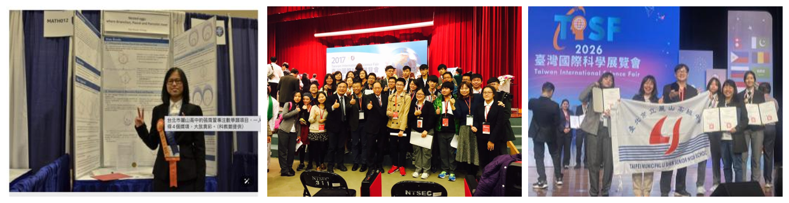
## Slide 8: 遊戲規則改變：並非學生退步，而是需要新路徑
- Title: 遊戲規則改變
- Key points:
  - 若只被動等待國家出資的 TISF 窄門，每年能站上國際舞台的學生極為有限，必須開闢主動出擊的藍海策略
  - 傳統模式（紅海）：在國內爭奪極少數國家代表權，內耗嚴重、機會狹窄
  - 進化模式（藍海）：主動自費出國，報名具國際公信力的筑波 Science Edge 競賽
  - 變革效益：出國發表學生人數從 1-2 位大幅提升至 30-40 位，擴展國際舞台機會
- Layout role: comparison

## Slide 9: 戰略轉型：走向「主動出國」的藍海策略
- Title: 走向「主動出國」的藍海策略
- Key points:
  - 翻轉被動思維，透過自費與專案補助主動報名日本 Tsukuba Science Edge 競賽
  - 出國發表學生人數從 1-2 位大幅提升至 30-40 位，擴展國際舞台機會
  - 以國際賽事的高強度學術標準，回推並深化校內專題研究的品質，落實普及化國際教育
- Layout role: concept explanation

## Slide 10: 策略引導：國際教育 2.0 政策下的雙軌轉型
- Title: 國際教育 2.0 與雙軌轉型
- Key points:
  - 響應教育部重啟國際教育旅行白皮書 2.0「課程化、在地化、永續化」原則
  - 行政團隊角色轉變：從「不出錯的程序執行者」轉型為「引領變革的課程領航者」
  - 核心定義「科學移動力」：運用學術英語進行科學論證，與國際夥伴進行對等學術對話
- Layout role: process

## Slide 11: 麗山高中的國際教育四項策略目標
- Title: 麗山國際教育策略目標
- Key points:
  - 策略一：以校本專題為核心融入 SDGs 永續目標，將在地研究轉化為國際對話
  - 策略二：強化素養教育，培養具國際移動力與危機處理能力之全人學生
  - 策略三：營造全球公民校園，引導學生在真實情境中尊重跨文化多元差異
  - 策略四：深化跨國學術合作，推動校際姐妹校締結，推動學校永續品牌
- Layout role: architecture

## Slide 12: 研究目的與待答問題
- Title: 研究目的與待答問題
- Key points:
  - 目的一：系統性解構傳統教育行政困境，建構「行政領航五力模型」
  - 目的二：剖析專題研究課程如何透過行政創新與三合一模式形成「在地深耕、全球發聲」
  - 目的三：透過三學年度實證資料，分析本模式對學生 ESP 學術英文及全球公民素養之成效
  - 目的四：歸納成功要素，提供其他高中在推動深耕型國際教育旅行時之具體參考
- Layout role: concept explanation

## Slide 13: 文獻探討 1：STEM 國際教育趨勢與行政轉型
- Title: STEM 國際教育與行政轉型
- Key points:
  - STEM 素養四層次 (Bybee)：跨領域整合、真實情境應用與全球 SDGs 議題對接
  - 課程領導 (Glatthorn)：有效的課程領導必須跨越「行政—教學」藩籬，預算與人員對接課程
  - 轉型領導者 (Bass)：具備理想化影響與智識啟發，引領組織進行根本性變革
- Layout role: concept explanation

## Slide 14: 文獻探討 2：隱性知識傳遞 (SECI 知識螺旋)
- Title: SECI 知識螺旋與隱性知識
- Key points:
  - 知識螺旋 (Nonaka)：將個人的隱性經驗，系統性外化為組織的顯性資產
  - 國際教育中的隱性知識：帶隊教師的防禦策略、危機處理，及日本實驗室嚴謹的職人纪律
  - 行政任務：建構分享場域與平台，使經驗能在人員異動中永續傳承
- Layout role: architecture

## Slide 15: 貳、研究方法與實施歷程
- Title: 貳、研究方法與實施歷程
- Subtitle: 行動研究設計與教育旅行模式歷史演進
- Layout role: section divider

## Slide 16: 行動研究方法與研究場域人員
- Title: 行動研究方法與場域
- Key points:
  - 研究方法：行動研究法，循「規劃—行動—觀察—反省—再規劃」螺旋循環
  - 研究場域：臺北市立麗山高級中學
  - 參與人員：校長室、行政處室主管，以及自然科與英文科教師團隊
  - 實施歷程：橫跨 112 至 114 學年度，累計帶領 106 名學生赴日
- Layout role: process

## Slide 17: 歷史演進：傳統模式與進化模式對比
- Title: 教育旅行模式的歷史演進
- Key points:
  - 核心定位：通識性文化體驗 ➔ 科學專題發表與學術競技（輸出型交流）
  - 行程模式：景點參訪與才藝交流 ➔ 競賽、交流、參訪三合一
  - 行前培訓：國際禮儀與基礎日語 ➔ 英文論文寫作、海報設計、全英文口答辯
  - 成果產出：中文心得與遊記 ➔ 英文摘要、海報簡報，結合學習歷程嚴格檢核
- Layout role: data evidence
- Required images:
  - Slide 17 multi-image collage; strict input asset; preserve layout and photos

    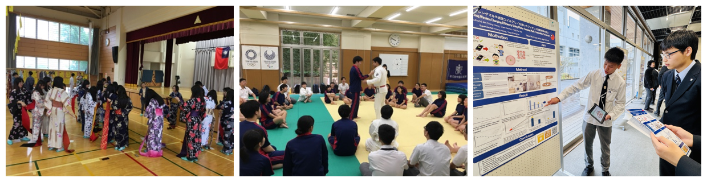
## Slide 18: 進化模式實證數據：兩大時期對比表
- Title: 兩大時期教育旅行模式對比
- Key points:
  - 呈現表 2。詳細分析傳統模式與進化模式在比較維度上的差異
  - 凸顯學生從被動的「觀眾」轉變為高強度學術實戰的「主角」
  - 說明跨科教師微課程如何直接對接並提升學生的學術英語與科研發表能力
- Layout role: data evidence

## Slide 19: 近三年日本教育旅行行程精緻化演進
### Text
- 2024 廣泛接觸期：交流千葉長生高與都立科技高(2所)，參訪千葉科學館、晴空塔。主動測試學生適應力，觀光科普比重較重。
- 2025 聚焦精銳期：聚焦交流都立科技高(1所)以深化對話，參訪航空科學博物館、防災館等。轉向具流體力學與防震實作場域。
- 2026 深度整合期：深化都立科技高交流(締結姊妹校)，參訪JAXA與進行淺草寺-晴空塔古今制震對照。實施減法哲學並引入都市生存任務。
## Slide 20: 學生甄選機制演進：建立正向科研文化誘因
- Title: 學生甄選機制演進
- Key points:
  - 呈現表 4。2024年廣納期：確保基本參賽能力，有專題成果即可
  - 2025年精進期：提升語言防禦門檻，英/日檢通過者優先
  - 2026年成熟期：明確排序科展成就、學業德行列入，建立正向競賽文化誘因
  - 設計邏輯：確保研究具競爭力、激勵平日科研風氣、並維護國家與麗山校譽
- Layout role: data evidence

## Slide 21: 參、研究結果與討論
- Title: 參、研究結果與討論
- Subtitle: 行政領航五力模型與校本課程國際化
- Layout role: section divider

## Slide 22: 行政領航五力模型：驅動行政角色轉型
- Title: 行政領航五力模型
- Key points:
  - 策略引領力：轉型領導者的願景引領與示範效應
  - 矩陣協作力：打破處室藩籬，以課程目標為中心的橫向協作
  - 知識管理力：建構「麗山智匯」平台，外化隱性傳承經驗
  - 財務領導力：課程目標導向反推預算編列，落實教育平權
  - 組織學習力：滾動式修正與螺旋式缺失檢討機制
- Layout role: architecture

## Slide 23: (一) 策略引領力：轉型領導者的願景帶動
- Title: 策略引領力
- Key points:
  - 校長親自率隊出訪，發揮強大示範效應，釋放學校全力支持訊號
  - 在大會競賽現場為學生加油，提升帶隊教師與學生的榮譽感與被正視感
  - 親自主持行前培訓、模擬評審答辯，帶動行政與教學團隊持續深化課程設計
- Layout role: concept explanation
- Required images:
  - Slide 23 multi-image collage; strict input asset; preserve layout and photos

    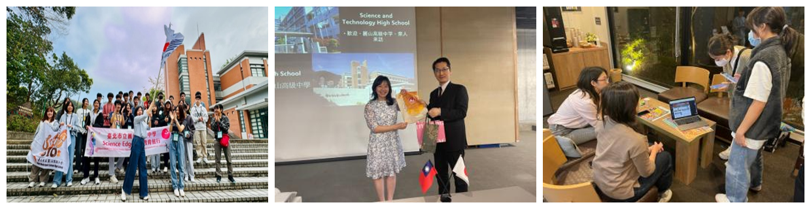
## Slide 24: (二) 矩陣協作力：打破處室藩籬的跨域整合
- Title: 矩陣協作力
- Key points:
  - 呈現表 5。比較傳統垂直分工模式 vs 麗山矩陣式協作模式
  - 組織結構：打破處室本位，以「課程目標」為中心成立「國際教育推動小組」
  - 業務歸屬：旅行與課程深度融合，學務處主辦，教務處、秘書室協辦
  - 溝通模式：從被動公文往返，轉為頻繁雲端共筆與即時對話
- Layout role: data evidence

## Slide 25: 國際教育推動小組之跨處室分工架構
- Title: 推動小組跨處室分工
- Key points:
  - 校長：行政總領航者，主持外交與大會對話
  - 學務處：活動統籌、招標發包、選才機制設計、安全督功
  - 教務處：課程對接、學術英文微課程開設、國際學術交流對接
  - 秘書室：對日學校聯繫、外賓接待、英文翻譯協辦
  - 總務與會計：預算編列、核銷作業、弱勢補助行政支援
  - 教師團隊：自然與英文科教師，負責專題指導、培訓微課程與隨隊競賽指導
- Layout role: architecture

## Slide 26: (三) 知識管理力與「麗山智匯」平台
- Title: 知識管理力
- Key points:
  - 痛點：行政人員或帶隊教師輪替易造成隱性經驗流失
  - 解方：參考 Nonaka SECI 知識螺旋，建構雲端「麗山智匯」平台
  - 外化資產：收錄賽前培訓教材、學生發表範例、危機 SOP、姊妹校交流流程
  - 效益：下屆承辦人不必再從零摸索，確保國際教育的永續傳承
- Layout role: concept explanation

## Slide 27: (四) 財務領導力與 (五) 組織學習力
- Title: 財務領導與組織學習
- Key points:
  - 財務領導：以課程目標反推預算，編列培訓鐘點費與海報費，並高額補助弱勢出國團費，落實機會均等
  - 組織學習：線上申請報名實現行政減量；建立行程檢核 SOP
  - 滾動修正：賽後檢討會反饋，2025年起加入「模擬答辯」，2026年起執行「定稿機制」
- Layout role: concept explanation

## Slide 28: 課程領航：國際交流與校本專題之系統化期程
- Title: 國際交流結合校本課程期程
- Key points:
  - 呈現表 6。展示麗山特色課程五階段
  - 第一階段：領域探索（9-11月，研究方法模組教學）
  - 第二階段：專題初探（11-1月，設定主題與規劃實驗）
  - 第三階段：專題研究（1-1月，進行實驗、收集數據與撰寫報告）
  - 第四階段：專題發表（2-4月，國內科展與日本 Science Edge 發表）
  - 第五階段：專題進階（4-6月，北市與全國科展，投稿科學期刊）
- Layout role: data evidence
- Required images:
  - Slide 28 multi-image collage; strict input asset; preserve layout and photos

    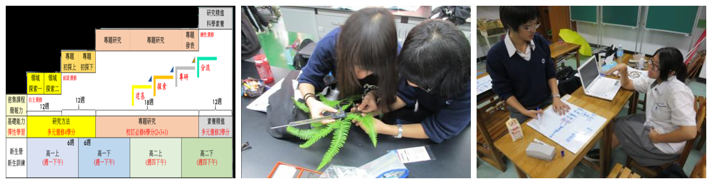
## Slide 29: 發表舞台的雙軌擴充與適性分流
- Title: 發表舞台適性分流
- Key points:
  - 契機：日本教育旅行時間點與高二專題發表期程完美對接
  - 擴充：將專題發表從校內體育館中文發表，延伸至日本筑波大學英文發表
  - 分流機制：區分「國內發表中文報告」與「國外發表英文報告」雙軌
  - 教育意義：學生可依專題作品成熟度與自身英語能力，選擇最適合的適性舞台
- Layout role: comparison
- Required images:
  - Slide 29 multi-image collage; strict input asset; preserve layout and photos

    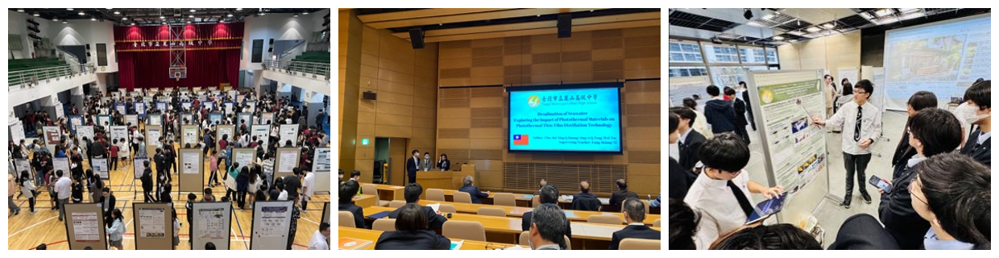
## Slide 30: 學術培訓鷹架：20 小時模組化學術微課程
- Title: 20小時學術微課程規劃
- Key points:
  - 呈現表 7。分為兩大培訓模組，由自然與英文科教師跨科協同主授
  - 英文科學論文寫作（10小時）：獲獎邏輯解構、英文摘要寫作、SDGs 對接、海報設計
  - 英文論文口語發表（10小時）：TED 演講技巧、語調矯正、避險句型、模擬答辯
  - 鷹架建立：從文字邏輯、視覺表達，逐步建構到口語答辯的學術防禦力
- Layout role: data evidence

## Slide 31: 鷹架階段一：英文科學論文寫作與視覺敘事
- Title: 論文寫作與海報設計
- Key points:
  - 摘要寫作：學習將實驗報告濃縮為兩頁英文摘要，導入 AI 工具文法潤飾
  - 選題與對接：引導將題目對接 SDGs 永續目標，提升國際評審關注度
  - 海報設計：教導視覺動線（標題-方法-圖表-結論），強調「圖表會說話」
  - Gallery Walk：舉辦海報初評，進行同儕互評與動態修正
- Layout role: concept explanation
- Required images:
  - Slide 31 multi-image collage; strict input asset; preserve layout and photos

    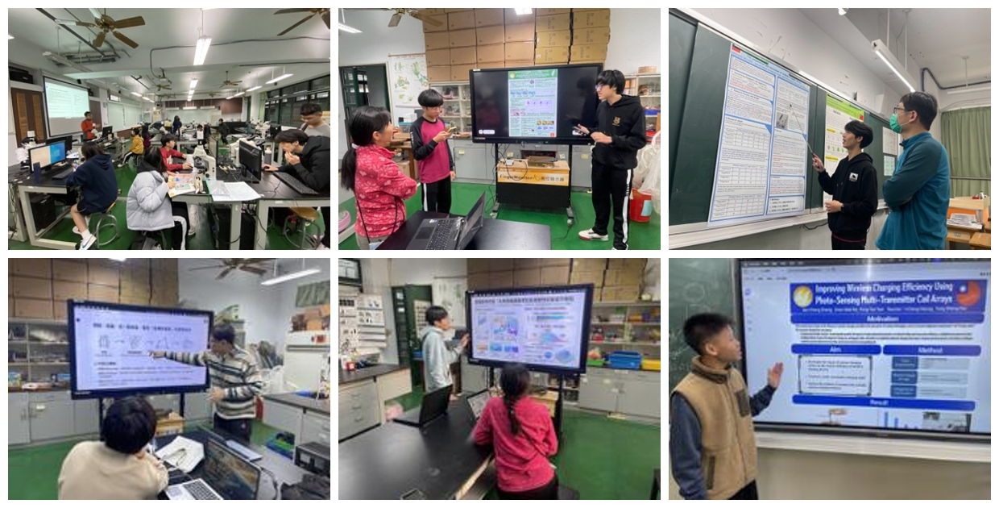
## Slide 32: 鷹架階段二：口語發表特訓與「魔鬼評審團」
- Title: 口語發表與魔鬼特訓
- Key points:
  - 英語口說：訓練科學術語重音、眼神接觸、肢體語言
  - Q&A 攻防：培訓高壓下抓取評審問句關鍵字，使用避險句型應對
  - 魔鬼特訓：隨隊教師在飯店晚間扮演嚴苛教授，進行全真答辯模擬
  - 核心領悟：邏輯推演與清晰圖表是最好的答辯武器，破除對英語口語的恐懼
- Layout role: concept explanation
- Required images:
  - Slide 32 multi-image collage; strict input asset; preserve layout and photos

    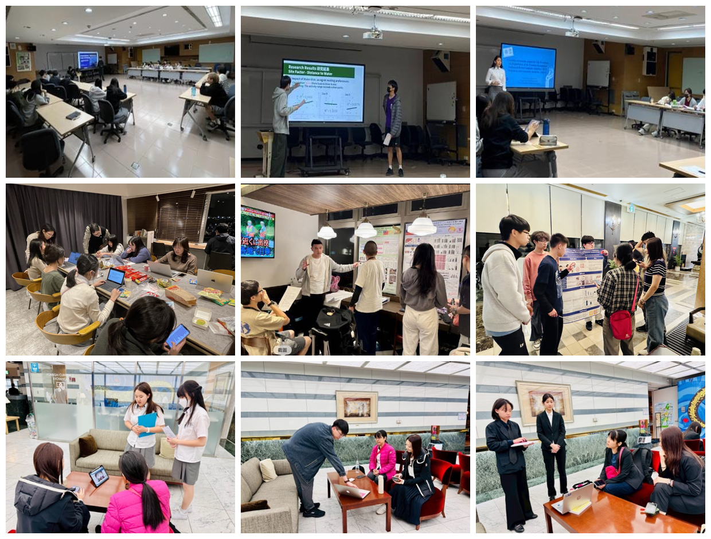
## Slide 33: 肆、三合一創新模式之實踐成效
- Title: 肆、三合一創新模式之實踐成效
- Subtitle: 競賽、交流、參訪三合一模式實證分析
- Layout role: section divider

## Slide 34: 實踐一：競賽 (Competition) ── 筑波 Science Edge 國際舞台
- Title: 競賽：筑波 Science Edge 實踐
- Key points:
  - 堅持兩日完整賽程：讓學生完全沉浸在國際頂尖科學賽事氛圍中
  - SDGs 對接：要求參賽作品闡述其「創新性」、「創意」與「社會可行性」
  - 四大發表形式：大會場口頭發表、衛星分組發表、攤位海報展示、樓層海報展示
  - 實戰意義：學生跳脫單純的數據呈現，將在地研究提升至全球永續發展高度
- Layout role: architecture
- Required images:
  - Slide 34 multi-image collage; strict input asset; preserve layout and photos

    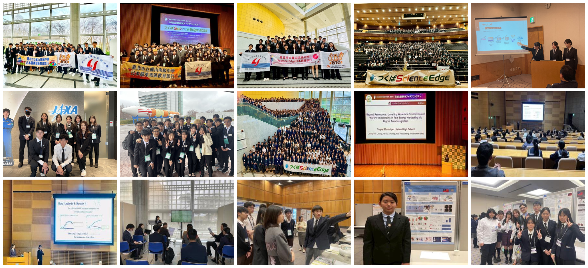
## Slide 35: 麗山代表性專題與 SDGs 全球議題之對接
- Title: 專題與 SDGs 對接成果
- Key points:
  - 呈現表 8。列舉麗山學生近年在 Science Edge 獲獎專題與 SDGs 的對接
  - SDGs 7 (可負擔能源)：雨水能量收集、翼尖小翼風力發電
  - SDGs 14 & 15 (海洋與陸地生態)：蝌蚪游泳速度、蛇類運動生物力學、斑腿樹蛙繁殖防治
  - SDGs 3 (健康與福祉)：脂肪酸衍生物對免疫細胞殺傷膠質瘤能力之影響
- Layout role: data evidence

## Slide 36: 實踐二：交流 (Exchange) ── 千葉縣立長生高校混合科學實作
- Title: 交流：長生高校混合實作
- Key points:
  - 學校背景：創立於1888年之百年重點 SSH 學校
  - 沉浸體驗：室內更換室內鞋、管樂團迎賓樂曲等日本傳統校園氛圍
  - 混合探究：臺日學生混合編組，共同運用物理原理設計力學機關
  - 交流成效：共同任務迫使學生放下英語文法包袱，體會「數理邏輯是共通語言」
- Layout role: concept explanation
- Required images:
  - Slide 36 multi-image collage; strict input asset; preserve layout and photos

    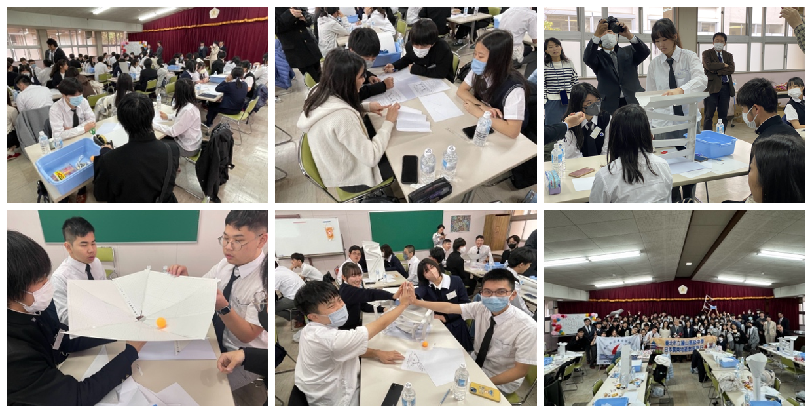
## Slide 37: 實踐二：交流 (Exchange) ── 東京都立科學技術高校姊妹校學術激盪
- Title: 交流：都立科技高校姊妹校
- Key points:
  - 學校背景：日本培養頂尖科學家之搖籃，2025年正式與麗山締結姊妹校
  - 學術對話：全英文海報發表、學術簡報交流、參觀先進科學實驗室
  - 同儕效應：日本學生關心社會實用選題（如蟾蜍花紋識別），激勵麗山學生科研的社會價值
  - 職人精神：日本實驗室嚴謹的數據追求、整齊收納與記錄習慣，震撼並深化學生研究態度
- Layout role: concept explanation
- Required images:
  - Slide 37 multi-image collage; strict input asset; preserve layout and photos

    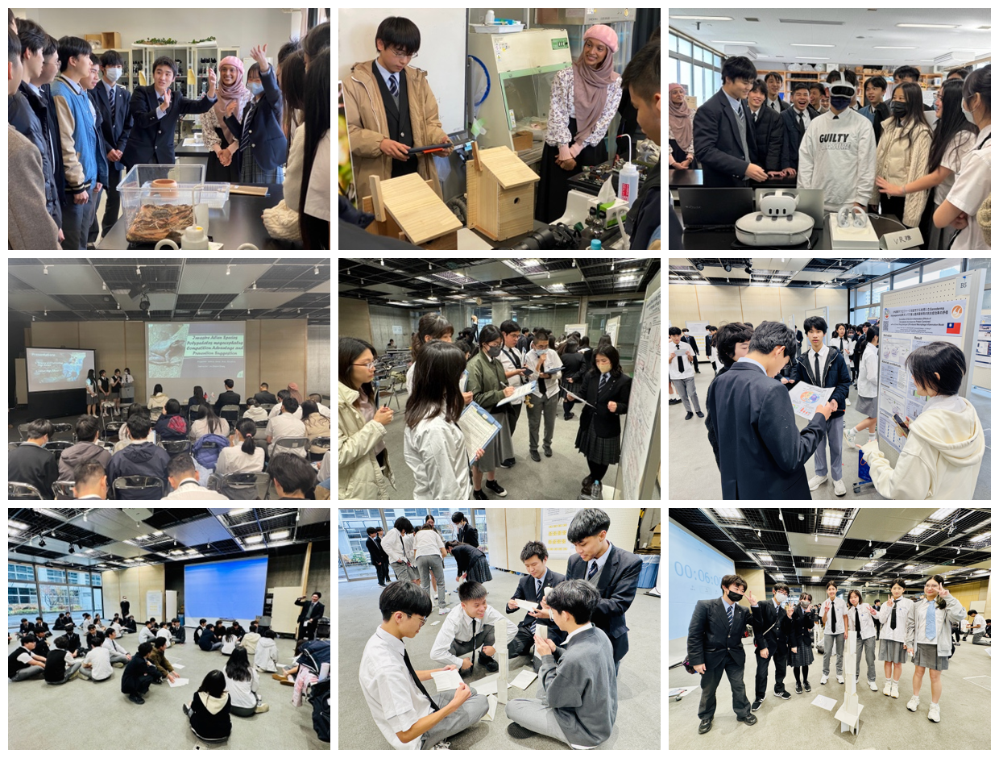
## Slide 38: 實踐三：參訪 (Visit) ── 貫徹減法哲學的場域探究
- Title: 參訪：減法哲學深度探究
- Key points:
  - 減法原則：摒棄景點數量最大化，強制設定知識場域「至少一小時停留底線」
  - 跨時空抗震工程對話：對比五重塔「心柱」抗震與晴空塔的核心制震技術
  - 人工生態系與 SDGs：墨田水族館領先全球的人工海水生成系統，減少碳足跡
  - 比較地質學：國立科學博物館日本館，對照臺日板塊構造與防災宿命
- Layout role: concept explanation
- Required images:
  - Slide 38 multi-image collage; strict input asset; preserve layout and photos

    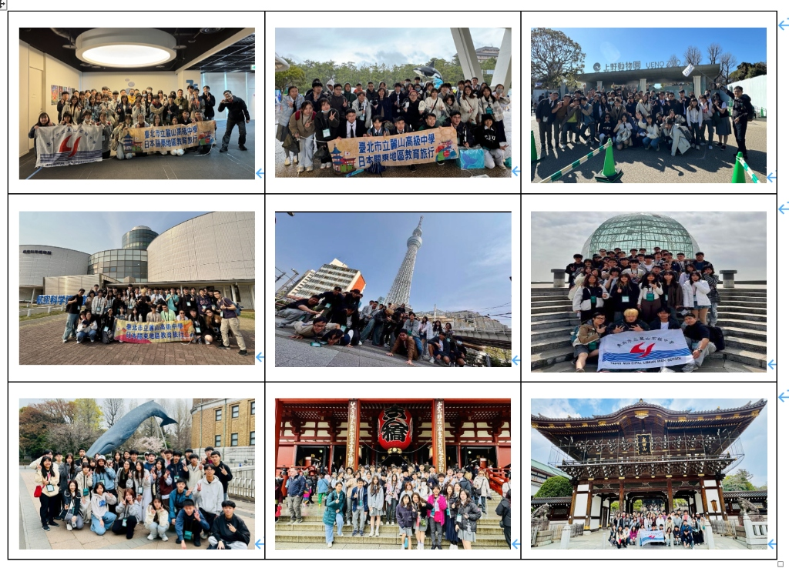
## Slide 39: 非結構化學習：東京都市自主生存演練
- Title: 都市探索與生存演練
- Key points:
  - 行動設計：拔除遊覽車與教師保護傘，發放西瓜卡 (Welcome Suica)，小組半日自主踏查
  - 真實試誤：經歷搭錯方向、找不到月台、點錯餐等窘境，被迫啟動小組危機決策
  - 核心成長：大幅提升獨立自主的抗壓性、決策力、團隊溝通與國際移動力
  - 未來升級：規劃加入學術觀察任務（如東京無障礙通用設計、大眾運輸動線力學）
- Layout role: concept explanation
- Required images:
  - Slide 39 multi-image collage; strict input asset; preserve layout and photos

    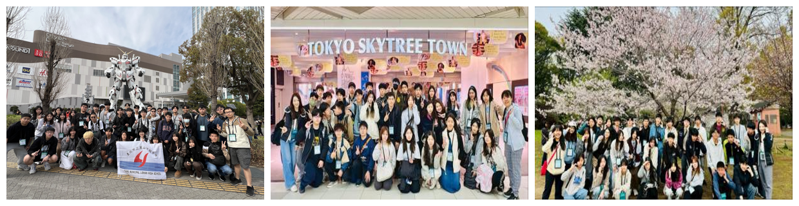
## Slide 40: 模式總對比：傳統觀光旅行 vs 三合一專題學術模式
- Title: 教育旅行模式對比矩陣
- Key points:
  - 呈現表 9。從七個維度系統性對比傳統觀光旅行與麗山三合一模式
  - 目標與定位：軟性文化體驗 vs 國際學術競爭力與科學移動力
  - 行政與課程：與課程脫鉤 vs 高度課程化（微課程 + 學習歷程檔案）
  - 交流與參訪：蜻蜓點水才藝表演與歷史神社 vs 全英文專題答辯與 JAXA/SSH 高中
  - 行政角色：業務承辦者 ➔ 課程領航者（編列培訓預算、知識管理平台）
- Layout role: data evidence

## Slide 41: 科學競賽能力之實證躍升：近三年成果展示
- Title: Science Edge 競賽成果躍升
- Key points:
  - 2024 年：11組海報/1組攤位/2組衛星，榮獲衛星發表二等獎、三等獎與現場海報獎
  - 2025 年：13組攤位海報/16組現場海報展示，榮獲大會現場海報獎（Floor Poster Award）
  - 2026 年：入圍 20 組創歷史新高，榮獲英文組第一名（大會補助）、第二名與口頭發表鼓勵賞
  - 延續發展：三組獲獎團隊獲大會推薦，代表參加新加坡 GLS 國際科學賽事
- Layout role: process
- Required images:
  - Slide 41 multi-image collage; strict input asset; preserve layout and photos

    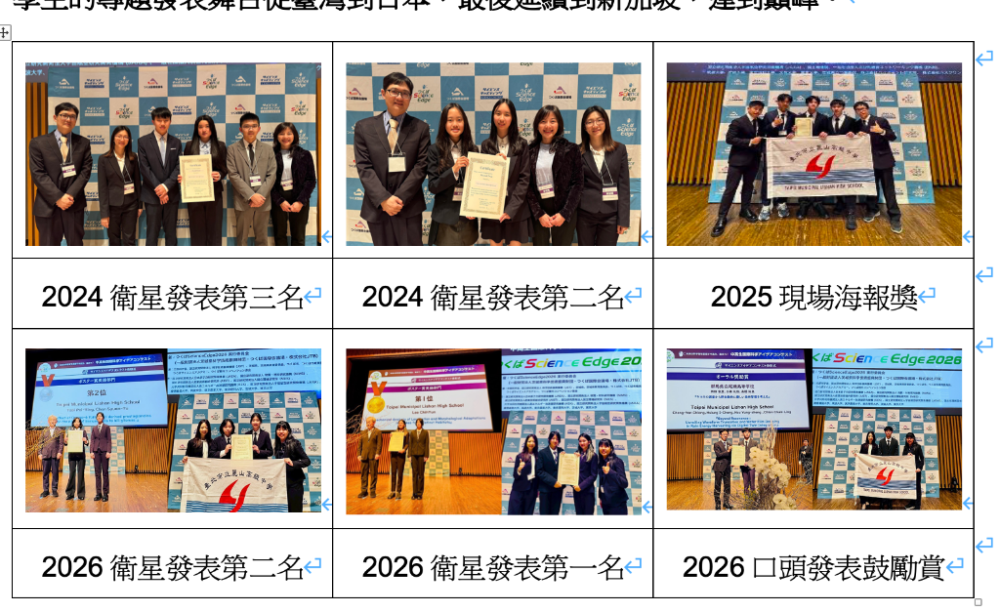
## Slide 42: 學生核心素養之質變：ESP 專業英文與人格韌性
- Title: ESP 學術英文與人格韌性
- Key points:
  - ESP 學術防禦：高壓答辯中迫使學生將英語作為「解決問題、捍衛論點」之工具
  - 人格韌性 (SEL)：無獲獎組別之情緒復原力培養，體悟科學交流價值在於「將心血傳遞世界」
  - 升學資本轉化：連結 SDGs 的專題與高質量學習歷程檔案，成為大學申請之有力佐證
  - 學校品牌擴散：官網新聞稿行銷，將學術榮譽成功轉化為「國際化特色科學高中」資產
- Layout role: concept explanation
- Required images:
  - Slide 42 multi-image collage; strict input asset; preserve layout and photos

    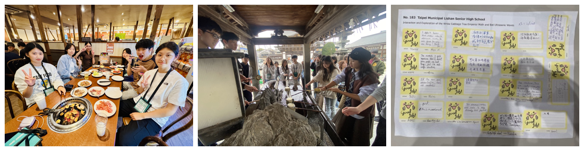
## Slide 43: 伍、實踐省思與未來展望
- Title: 伍、實踐省思與未來展望
- Subtitle: 行動研究省思與未來優化策略
- Layout role: section divider

## Slide 44: 行動研究省思與精緻化建議
- Title: 實踐省思與未來建議
- Key points:
  - 行程規劃：持續貫徹「減法哲學」，保證一小時停留，引進探究學習單或任務導向學習
  - 認知負荷管理：海外赛前完成簡報海報「最終定稿」，賽後隔日排出身心緩衝行程
  - 制度化協作：維持常態化推動小組，透過麗山智匯累積顯性經驗，避免因人員異動中斷
  - 財務平權：主動爭取教育部或民間補助，編列預算輔助弱勢，保障教育機會平權
- Layout role: architecture
- Required images:
  - Slide 44 multi-image collage; strict input asset; preserve layout and photos

    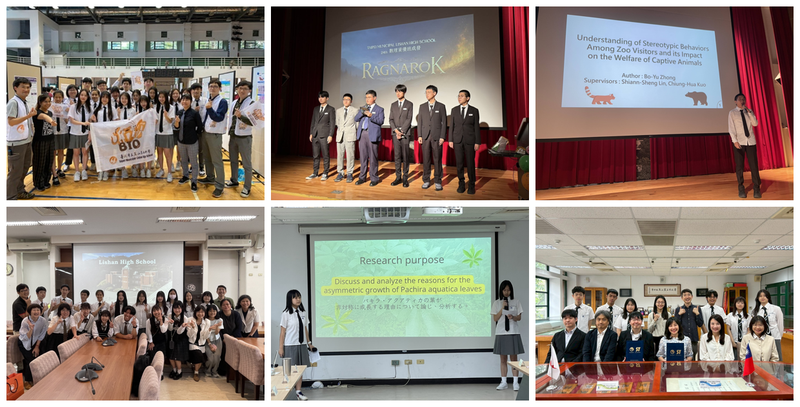
## Slide 45: 陸、結論：以校本專題走向世界的麗山經驗
- Title: 以校本專題與世界對話的麗山經驗
- Key points:
  - 證實行政創新能驅動教學變革與國際接軌
  - 成功採取藍海策略：跳出 TISF 紅海競爭，開闢學校自主、低門檻、普及化的國際發表渠道
  - 實施「主動出國 + 精銳培訓 + 三合一行程」，使國際發表從少數菁英教育轉為普及的廣度教育
  - 四大目標實現：專題本位、全人素養、全球公民、跨國合作與永續學校品牌
- Layout role: summary / closing
